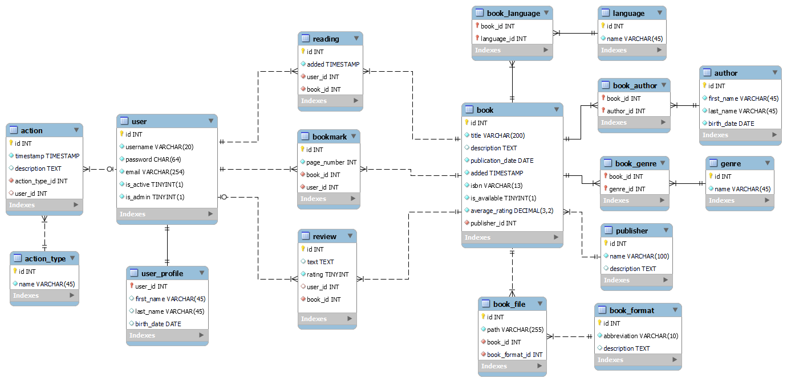

# MySQL-Electronic-Library
>Тема: Электронная Библиотека  

- [Функциональные требования](#функциональные-требования)
- [Перечень сущностей](#перечень-сущностей)
- [Даталогическая модель](#даталогическая-модель)

## Функциональные требования
### Гость
1. Регистрация
2. Авторизация
3. Поиск книги (название / ISBN) с фильтрацией (жанр / издательство / автор / язык / формат / год издания) и сортировкой по рейтингу

### Пользователь
1. Требования [гостя](#гость)
2. Добавление (удаление) книг в (из) список (списка) для чтения
3. Добавление (удаление) закладок на страницах книг
4. Добавление (удаление) отзывов к книгам
5. Изменение профиля

### Администратор
1. CRUD операции с сущностями:
   - Книга
   - Язык
   - Автор
   - Жанр
   - Издательство
   - Формат книги
   - Файл книги
   - Пользователь
   - Профиль пользователя
   - Закладка
   - Отзыв
   - Чтение
   - Действие
   - Тип действия

## Перечень сущностей
1. __user__ - _пользователь_  
   
   Поля:
   - Логин (username) - строка, not null, уникальная, от 6 до 20 символов (A-Z, a-z, 0-9, _)
   - Пароль (password) - строка, not null, 64 символа (SHA256)
   - Почта (email) - строка, not null, уникальная, от 4 до 254 символов
   - is_active (активен ли аккаунт для использования) - bool, not null, default: true
   - is_admin (является ли пользователь администратором) - bool, not null, default: false

 

2. __user_profile__ - профиль пользователя  

   Поля:
   - Имя (first_name) - строка, nullable, до 45 символов
   - Фамилия (last_name) - строка, nullable, до 45 символов
   - Дата рождения (birth_date) - дата, nullable

   Связи:
   - OneToOne с __user__ (ON DELETE CASCADE)

 

3. __publisher__ - издательство

   Поля: 
   - Название (name) - строка, not null, уникальная, до 100 символов
   - Описание (description) - текст, nullable

 

4. __genre__ - жанр

   Поля:
   - Название (name) - строка, not null, уникальная, до 45 символов

   Связи:
   - ManyToMany с __book__

 

5. __author__ - автор

   Поля:
   - Имя (first_name) - строка, not null, до 45 символов
   - Фамилия (last_name) - строка, nout null, до 45 символов
   - Дата рождения (birth_date) - дата, not null

   Связи:
   - ManyToMany с __book__

 

6. __language__ - язык 

   Поля:
   - Название (name) - строка, not null, уникальная, до 45 символов

   Связи:
   - ManyToMany с __book__

 

7. __book__ - книга

   Поля:
   - Названия (title) - строка, not null, до 200 символов
   - Описание (description) - текст, nullable
   - Дата публикации (publication_date) - дата, not null
   - Временная метка добавления на сайт (added) - timestamp, not null, default: CURRENT_TIMESTAMP
   - Уникальный идентификатор книги (ISBN) - строка, not null, уникальная, от 10 до 13 символов
   - Доступна ли книга (is_available) - bool, not null, default: true
   - Средний рейтинг (average_rating) - decimal, not null, default: 0

   Связи:
   - ManyToOne с __publisher__ (ON DELETE RESTRICT)
   - ManyToMany с __language__
   - ManyToMany с __author__
   - ManyToMany с __genre__

 

8. __book_format__ - формат книги
   
   Поля:
   - Сокращение (abbreviation) - строка, not null, уникальная, от 1 до 10 символов
   - Описание (description) - текст, nullable

 

9. __book_file__ - файл книги

   Поля:
   - Путь (path) - строка, not null, уникальная, до 255 символов
  
   Связи:
   - ManyToOne с __book_format__ (ON DELETE NO ACTION)
   - ManyToOne с __book__ (ON DELETE CASCADE)

 

10. __reading__ - книги, читаемые пользователем

      Поля:
       - Временная метка добавления "в избранные" (added) - timestamp, not null, default: CURRENT_TIMESTAMP

      Связи:
      - ManyToOne с __book__ (ON DELETE CASCADE)
      - ManyToOne с __user__ (ON DELETE CASCADE)

 

11. __bookmark__ - закладка на странице книги
    
      Поля:
      - Номер страницы (page_number) - int, not null

      Связи:
      - ManyToOne с __book__ (ON DELETE CASCADE)
      - ManyToOne с __user__ (ON DELETE CASCADE)

 

12. __review__ - отзыв

      Поля:
      - Текст (text) - текст, nullable
      - Оценка (rating) - unsigned tinyint, not null, от 1 до 5  

      Связи:
      - ManyToOne с __book__ (ON DELETE CASCADE)
      - ManyToOne с __user__ (ON DELETE SET NULL)

 

13. __action__ - действие (для логгирования)
    
      Поля:
      - timestamp - not null, default: CURRENT_TIMESTAMP
      - text - nullable

      Связи: 
      - ManyToOne с __user__ (ON DELETE SET NULL)
      - ManyToOne с __action_type__ (ON DELETE NO ACTION)

 

14. __action_type__ - тип действия

      Поля:
      - Название (name) - строка, not null, уникальная, до 45 символов

## Даталогическая модель

